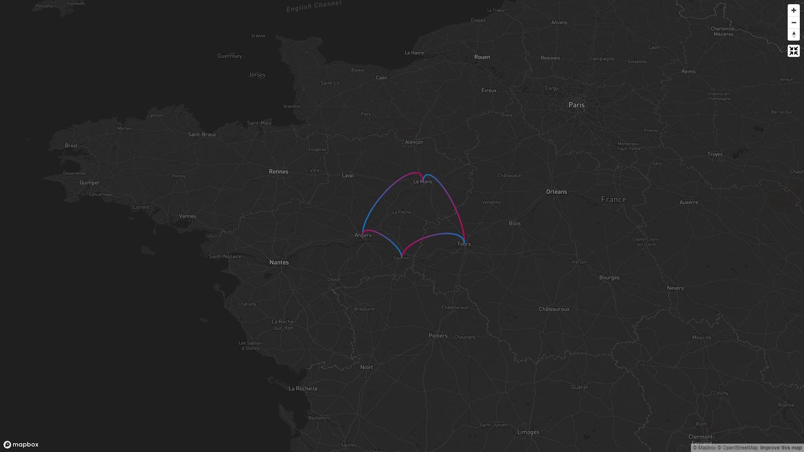

# Georide Arc Map

Little project (developped as a PoC for my personnal use) to display Georide trips on a map using arcs.

This feature was available on the official Georide web app but not working anymore (for now).



## Run

Note: the Docker integration is intended for production use.

### Requirements

-   Get a Mapbox API key (https://account.mapbox.com/access-tokens)

### Production

#### With Docker

-   Clone this repo and `cd` into it
-   Update the `docker-compose.yml` (or create a `docker-compose.override.yml`) to provide your Mapbox API key
-   Run `docker compose up --build`

```yaml
version: '3.4'

services:
    app:
        image: georide-arc-map
        build:
            context: .
            args:
                VITE_MAPBOX_API_KEY: 'your_mabpox_api_key'
        container_name: georide-arc-map
        restart: always
        ports:
            - 3000:80
```

### Development

This app use [Vite](https://vitejs.dev) and [pnpm](https://pnpm.io).

-   Clone this repo and `cd` into it
-   Create a `.env.local` file at the root of the project and provide your Mapbox API key (see `.env.example`)
-   Install the dependencies: `pnpm install`
-   Start the dev server: `pnpm run dev`
